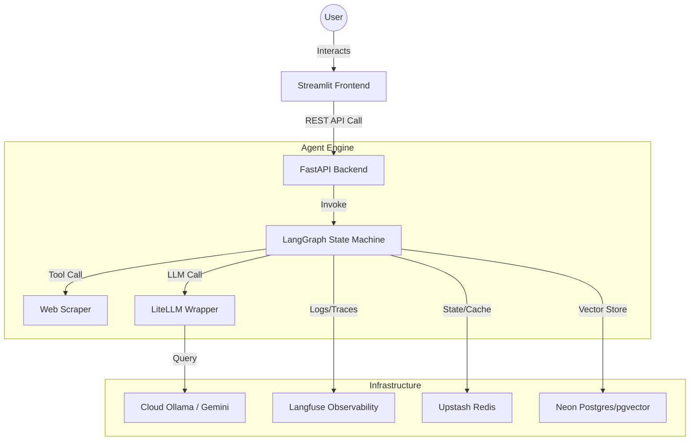
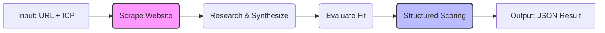

# 🤖 AI Agent Production Factory

[](https://fastapi.tiangolo.com/)
[](https://langchain-ai.github.io/langgraph/)
[](https://www.docker.com/)
[](https://streamlit.io/)
[](https://langfuse.com/)

Welcome to the **AI Agent Production Factory**. This is not a collection of "AI wrappers," but a modular, enterprise-grade framework designed to build, deploy, and monitor autonomous AI agents. 

The goal of this project is to build **30 production-ready agents in 30 days**, focusing on reliability, observability, and scalability.

## 🚀 Day 1: Lead Qualification Agent
The first agent in the factory is the **Lead Qualification Agent**. It transforms a raw company URL and an Ideal Customer Profile (ICP) into a structured business decision.

### The Problem
Sales teams waste 50% of their time on leads that don't fit their target profile. Manual research is slow and inconsistent.

### The Solution
A multi-step agentic pipeline that:
1. **Scrapes** live web content from the company URL.
2. **Researches** the company's core product and business model.
3. **Evaluates** the fit against a specific ICP.
4. **Scores** the lead with a structured JSON output (0-100).

---

## 🏗️ Architecture

### 1. System Overview
The system is decoupled into a **Frontend (UI)** and a **Backend (API)** to ensure independent scalability.



### 2. Agent Logic Flow (LangGraph)
Unlike linear chains, this agent uses a **State-Machine** to ensure each step is completed and validated before moving to the next.



---

## 🛠️ Technical Stack

| Layer | Technology | Purpose |
| :--- | :--- | :--- |
| **Orchestration** | `LangGraph` | Manages state and agentic loops for reliable execution. |
| **API Framework** | `FastAPI` | High-performance asynchronous API layer. |
| **LLM Gateway** | `LiteLLM` | Model-agnostic interface (Switch between Gemini/Ollama in 1 line). |
| **Observability** | `Langfuse` | Full-stack tracing, cost tracking, and latency monitoring. |
| **UI/Frontend** | `Streamlit` | Rapid deployment of professional AI interfaces. |
| **Data/Cache** | `Neon` / `Upstash` | Serverless Postgres (pgvector) and Redis for state management. |
| **Deployment** | `Docker` / `Render` | Containerized microservices for cloud portability. |

---

## ⚙️ Setup & Installation

### Prerequisites
- Docker & Docker Compose
- API Keys for Langfuse, Gemini/Ollama, Neon, and Upstash.

### Local Development
1. **Clone the repo:**
   ```bash
   git clone https://github.com/your-username/ai-agent-factory.git
   cd ai-agent-factory
   ```
2. **Configure Environment:**
   Create a `.env` file in the root:
   ```env
   DEFAULT_MODEL=gemini/gemini-1.5-flash
   GEMINI_API_KEY=your_key
   LANGFUSE_PUBLIC_KEY=your_key
   LANGFUSE_SECRET_KEY=your_key
   LANGFUSE_HOST=https://cloud.langfuse.com
   OLLAMA_API_BASE=https://your-cloud-ollama-url.com
   DATABASE_URL=postgresql://...
   REDIS_URL=redis://...
   ```
3. **Launch the Factory:**
   ```bash
   docker-compose up --build
   ```
4. **Access the UI:**
   Visit `http://localhost:8501`

---

## 📅 30-Day Roadmap
- [x] **Day 1: Lead Qualification Agent** (Scraping $\rightarrow$ Evaluation $\rightarrow$ Scoring)
- [ ] ... (More agents coming daily)

---

## 📩 Contact & Hire
I am building this factory to demonstrate the intersection of **Software Engineering** and **AI**. If you are looking for an AI Engineer who builds for reliability, observability, and scale, let's connect.

- **LinkedIn:** [https://www.linkedin.com/in/gurleen-singh-bhatia/]
- **Portfolio:** [https://gurleensingh1608-ai.lovable.app/]
- **Email:** [gurleensingh1608@gmail.com]

***